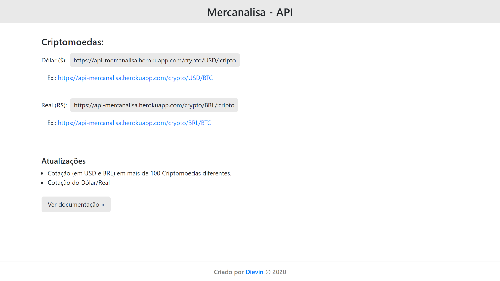

# Api Mercanalisa
> Projeto construído em Node JS/Express.

Api para cotação de preços de mais de 100 criptomoedas e moedas fiat. 

Veja a api em funcionamento aqui: https://api-mercanalisa.vercel.app



## Sobre

Mercanalisa surgiu de um projeto pessoal para estudo de conceitos e ferramentas. Pois necessitava de uma api para cotação de preços de criptomoedas e moedas fiat. Depois de testar opções do mercado e não ter os resultados esperados, resolvi criar minha própria solução.

## Features

- Response em formato JSON
- Mais de 100 criptomoedas diferentes
- Cotação das criptos em Dólar Americano e Real Brasileiro
- Cotação fiat: Dólar Americano/Real Brasileiro

## Como utilizar?
### #Criptomoedas

Para usar a api de cotação de criptomoedas utilize o path **/crypto** em seguida informe a moeda (**/USD** para Dólar ou **/BRL** para Real) e depois o símbolo da criptomoeda que queira consultar.(**/:symbol**)

Exemplo:
```
 https://api-mercanalisa.vercel.app/crypto/USD/BTC
```

Tabela com algumas das criptomoedas disponíveis:
| **#** | **Criptomoedas** | **Símbolo** |
|:-----:|:----------------:|:-----------:|
| **1** | Bitcoin          |     BTC     |
| **2** | Ethereum         |     ETH     |
| **3** | Tether           |     USDT    |
| **4** | XRP              |     XRP     |
| **5** | Litecoin         |     LCT     |
| **6** | ChainLink        |     LINK    |
| **7** | Bitcoin Cash     |     BCH     |
|   ~   | Continua...      |     ...     |

Veja a tabela completa aqui: [Tabela Criptomoedas](https://api-mercanalisa.vercel.app/docs).

### #Moedas Fiat

Para usar a api de cotação de moedas fiat utilize o path **/fiat**, em seguida o símbolo da moeda que deseja consultar.

Exemplo:
```
 https://api-mercanalisa.vercel.app/fiat/USD
```

Tabela das moedas fiat disponíveis:
| **#** | **Moedas Fiat** | **Símbolo** |
|:-----:|:---------------:|:-----------:|
| **1** | Dólar           |     USD     |

## Tecnologias

Projeto foi construído com as seguintes tecnologias:

- Typescript
- Node.js
- Express
- Cheerio